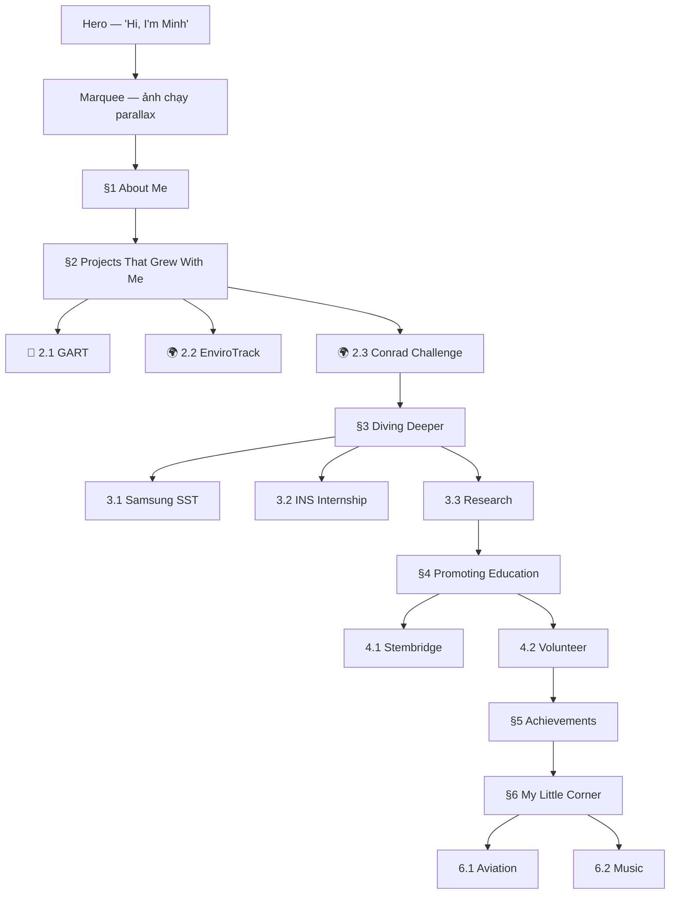

# 📋 Implementation Plan — Restructure Website theo content.md

> **Mục tiêu:** Website phải phản ánh đúng cấu trúc và nội dung trong `content.md`, bao gồm:
> - Đúng phân tầng sections (§2 → §3 → §4)
> - Đúng text (dùng nguyên văn từ content.md, không viết lại)
> - Đúng media layout (theo bảng media trong content.md)
> - Không trùng lặp nội dung giữa các section

---

## Trạng thái hiện tại

Website đang dùng **7 section** theo thứ tự:

```
Hero → Marquee → About → Journey (8 items gộp) → Projects (3 cards trùng) → Achievements → Personal Corner
```

**Vấn đề chính:**
1. §2, §3, §4 bị gộp thành 1 "Journey" → mất phân tầng
2. GART/EnviroTrack/Conrad xuất hiện 2 lần (Journey + Projects) → trùng lặp
3. Text trong website đã bị viết lại, không khớp nguyên văn content.md

---

## Flow mới mong muốn



---

## Chi tiết từng section

### Section 1: About Me
**content.md lines:** 5–9

| Yếu tố | Nguồn content.md | Hiện tại trên web | Cần thay đổi? |
|---|---|---|---|
| Heading | "About me" | "About me" | ❌ Giữ nguyên |
| Text | "Hi, welcome to my website!" + TODO funny | Custom paragraph khác | ⚠️ Xem xét — content.md ghi TODO, web đang dùng text viết sẵn. **Giữ web text hiện tại** cho đến khi có bản funny |
| Telemetry metrics | Không có trong content.md | 16-0, 25+, Top 25, 300+ | ⚠️ Giữ nguyên (bổ sung, không mâu thuẫn) |

**Kết luận:** ✅ Không cần thay đổi section này.

---

### Section 2: Projects That Grew With Me
**content.md lines:** 13–73 · **Heading:** "Projects that grew with me"

Đây là section phức tạp nhất. Có **2 sub-group** và **3 project items**.

#### Cấu trúc mong muốn:

```
Section Heading: "Projects That Grew With Me"
│
├── Sub-heading: "🤖 Robotics"
│   └── 2.1 GART
│       ├── Media table (6 sự kiện, mỗi sự kiện có ảnh riêng)
│       ├── Story (6 đoạn văn có bold sub-title)
│       └── Takeaway
│
├── Sub-heading: "🌍 Devices that solve my concerns"
│   ├── 2.2 EnviroTrack
│   │   ├── Media: Images + Poster
│   │   └── Story (2 đoạn)
│   └── 2.3 Conrad Challenge
│       ├── Media: Images + Link CAD + Link Conrad + ideon.skyhi.vn
│       └── Story (3 đoạn)
```

#### 2.1 GART — Chi tiết mapping

**Media (content.md lines 21–28):**

| Sự kiện | Media cần hiển thị | UI element đề xuất |
|---|---|---|
| Mock GART (Blue Team) | Ảnh Mock GART + Image of robot | Gallery thumbnail |
| FTC – Thanh Hoa Scrimmage | Image + Image of robot | Gallery thumbnail |
| FTC – National | Image + TV/Press + Image of robot | Gallery thumbnail (multi) |
| FTC – Worlds | Image + TV/Press + Image of robot | Gallery thumbnail (multi) |
| Deputy PM Recognition | Image | Gallery thumbnail |
| GART Expo · Camp · Training | Images | Gallery thumbnails |

> [!IMPORTANT]
> content.md liệt kê media theo **sự kiện**, không theo tab Video/CAD/Field. Cần quyết định:
> - **Option A:** Giữ layout hiện tại (Video/CAD/Field tabs) nhưng mapping ảnh theo sự kiện
> - **Option B:** Đổi sang timeline/event-based gallery (mỗi sự kiện là 1 slide)
> - **Option C:** Dùng scrollable gallery strip theo thứ tự sự kiện

**Story (content.md lines 32–46) — Nguyên văn 6 đoạn:**

| Đoạn | Bold title | Dòng | Hiển thị thế nào |
|---|---|---|---|
| 1 | "Bắt đầu với Mock GART." | L32 | Expandable paragraph |
| 2 | *(tiếp đoạn 1)* | L34 | Expandable paragraph |
| 3 | "FIRST Tech Challenge (FTC)." | L36–38 | Expandable paragraph |
| 4 | "Leadership & Mentoring." | L40 | Expandable paragraph |
| 5 | "Training & GART Camp." | L42 | Expandable paragraph |
| 6 | "GART Expo." | L44 | Expandable paragraph |
| 7 | "Takeaway." | L46 | Highlight quote box |

> [!NOTE]
> Website hiện tại gộp toàn bộ thành 1 đoạn narrative duy nhất. content.md có **7 sub-sections** với bold titles riêng. Cần giữ lại các bold sub-titles để người đọc dễ scan.

#### 2.2 EnviroTrack — Chi tiết mapping

**content.md lines:** 52–58

| Yếu tố | Nội dung | UI |
|---|---|---|
| Media | [Images + Poster] | Gallery/media tabs |
| Story đoạn 1 | "I want to use what I learned..." (L56) | Main paragraph |
| Story đoạn 2 | "At WICO, experts challenged us..." (L58) | Main paragraph |
| Bold highlights | "EnviroTrack", "25+ refined devices" | Inline bold |

#### 2.3 Conrad Challenge — Chi tiết mapping

**content.md lines:** 60–73

| Yếu tố | Nội dung | UI |
|---|---|---|
| Media Images | [Images] | Gallery |
| Link CAD | [Link CAD] | External link button |
| Link Conrad team | [Link đội thi trên web Conrad] | External link button |
| Link Ideon | https://ideon.skyhi.vn/about | External link button |
| Story đoạn 1 | "EnviroTrack made me realize..." (L69) | Main paragraph |
| Story đoạn 2 | "We developed an autonomous..." (L71) | Main paragraph |
| Story đoạn 3 | "After 4 iterations..." (L73) | Main paragraph |
| Bold highlights | "autonomous underwater vehicle", "one of 25 teams selected from 1,000+ teams" | Inline bold |

#### Layout decision cho §2:

> [!TIP]
> **Đề xuất:** Giữ dark card style từ ProjectsSection hiện tại (có media tabs, challenge/solution, telemetry) vì nó phù hợp với 3 projects lớn. Nhưng cần:
> 1. Dùng **nguyên văn** text từ content.md (không viết lại summary/challenge/solution)
> 2. Thêm sub-headings "🤖 Robotics" và "🌍 Devices that solve my concerns"
> 3. Story expand phải giữ bold sub-titles từ content.md
> 4. Xem xét media layout theo sự kiện thay vì Video/CAD/Field

---

### Section 3: Diving Deeper
**content.md lines:** 77–109 · **Heading:** "Diving deeper"

#### Cấu trúc:

```
Section Heading: "Diving Deeper"
│
├── 3.1 Samsung SST
│   ├── Media: [Images]
│   └── Story (3 đoạn)
│
├── 3.2 INS Internship
│   ├── Media: [Image]
│   └── Story (3 đoạn + shoutout)
│
└── 3.3 Research
    ├── Media: [Image] + [PDF journal]
    └── Story (3 đoạn)
```

#### 3.1 Samsung SST (L79–87)

| Yếu tố | content.md text | Ghi chú |
|---|---|---|
| Story đoạn 1 | "I was fortunate to be selected as one of 10..." (L83) | Nguyên văn |
| Story đoạn 2 | "At Samsung R&D Vietnam, I strengthened..." (L85) | **Bold:** "Advanced level" |
| Story đoạn 3 | "For my capstone project..." (L87) | **Bold:** "3D reconstruction tool for preserving artifacts using Gaussian Splatting" |

#### 3.2 INS Internship (L89–99)

| Yếu tố | content.md text | Ghi chú |
|---|---|---|
| Opening | "Engaging in electrical engineering..." (L93) | Intro sentence |
| Story đoạn 1 | "During my three-month summer internship..." (L95) | Main paragraph |
| Story đoạn 2 | "Apart from learning power system physics..." (L97) | **Bold:** "ETAP", "PSS/E" |
| Story đoạn 3 | "More importantly, I got to learn..." (L99) | Personal shoutout |

#### 3.3 Research (L101–109)

| Yếu tố | content.md text | Ghi chú |
|---|---|---|
| Media | [Image] + [PDF journal] | Cần PDF download link |
| Story đoạn 1 | "As I explored the field..." (L105) | Intro |
| Story đoạn 2 | "Under the guidance of..." (L107) | **Bold:** "NDO-MPC control methods" |
| Story đoạn 3 | "I was especially proud when..." (L109) | **Bold:** "accepted at the GTSD conference" |

#### Layout decision cho §3:

> Sử dụng **accordion list** trên nền **trắng** (tương phản với §2 dark). Mỗi item có thumbnail, tag, location, summary, và expandable full story giữ nguyên bold từ content.md.

---

### Section 4: Promoting Education
**content.md lines:** 113–147 · **Heading:** "Promoting Education"

#### Cấu trúc:

```
Section Heading: "Promoting Education"
│
├── 4.1 Stembridge
│   ├── Media table (4 hạng mục)
│   ├── Story (2 đoạn chung)
│   ├── 📍 Quan Sơn Boarding School (1 đoạn)
│   ├── 📍 Xa Dan School for Deaf Students (1 đoạn)
│   └── Takeaway (highlight quote)
│
└── 4.2 Volunteer
    ├── Media: Cosmosics [Images] + Red River VEX [Images]
    └── Story (1 đoạn ngắn)
```

#### 4.1 Stembridge media (L119–124):

| Hạng mục | Media | UI element |
|---|---|---|
| STEM Fairs | [Images] | Gallery thumbnails |
| Donating Makerspace + Experiments | [Images] | Gallery thumbnails |
| Workshops to teach | [Images] | Gallery thumbnails |
| Social / Press | [FB links] + [Link báo] | External link buttons |

#### Stembridge locations — Cần tách rõ (L130–136):

| Địa điểm | Nội dung | UI |
|---|---|---|
| 📍 Quan Sơn, Lạng Sơn | "Students live and study in a remote..." **Bold:** "300 students" | Location card with pin icon |
| 📍 Xa Dan Deaf School | "The challenge was different..." | Location card with pin icon |
| Takeaway | "Working with these students made me understand..." (L138) | Highlight quote box |

#### Layout decision cho §4:

> Nền **dark** (tương phản với §3 white). Card layout với expandable story. Stembridge card có sub-sections cho từng địa điểm. Volunteer card nhỏ gọn hơn.

---

### Section 5: Achievements
**content.md lines:** 151–155

| Yếu tố | content.md | Hiện tại | Cần thay đổi? |
|---|---|---|---|
| Heading | "My achievements" | "Achievements" | 🟡 Minor — có thể đổi |
| Content | "Certificates + award photos" | 3D sphere 18 achievement cards | ❌ Giữ nguyên — web đã mở rộng tốt |

**Kết luận:** ✅ Giữ nguyên AchievementsSection.

---

### Section 6: My Little Corner
**content.md lines:** 159–176

| Yếu tố | content.md | Hiện tại | Cần thay đổi? |
|---|---|---|---|
| Heading | "My little corner" | "Personal Corner" | 🟡 Có thể đổi thành "My Little Corner" |
| 6.1 Aviation text | Nguyên văn L165–167 | Gần giống, đã paraphrase nhẹ | ⚠️ Kiểm tra sát content.md |
| 6.2 Music text | Nguyên văn L173 | Gần giống | ⚠️ Kiểm tra sát content.md |
| Fun fact | "The band behind..." (L175) | Có trong web | ✅ |

**Kết luận:** ⚠️ Cần review lại text cho sát content.md, nhưng structure đúng.

---

## Tổng hợp thay đổi files

| # | Action | File | Chi tiết |
|---|---|---|---|
| 1 | 🆕 Tạo mới | `ProjectsGrowthSection.tsx` | §2 — 3 project cards (GART, EnviroTrack, Conrad) với text nguyên văn content.md |
| 2 | 🆕 Tạo mới | `DivingDeeperSection.tsx` | §3 — 3 accordion items (Samsung, INS, Research) với text nguyên văn |
| 3 | 🆕 Tạo mới | `EducationSection.tsx` | §4 — Stembridge (tách locations) + Volunteer |
| 4 | ✏️ Sửa | `App.tsx` | Thay JourneySection + ProjectsSection bằng 3 section mới |
| 5 | ✏️ Sửa | `HeroSection.tsx` | Navbar links → match section IDs mới |
| 6 | ✏️ Sửa | `PersonalCornerSection.tsx` | Heading + review text sát content.md |
| 7 | 🗑️ Xóa import | `JourneySection.tsx` | Không còn dùng (giữ file, bỏ import) |
| 8 | 🗑️ Xóa import | `ProjectsSection.tsx` | Không còn dùng (giữ file, bỏ import) |

---

## Câu hỏi cần xác nhận trước khi code

> [!WARNING]
> Cần bạn quyết định trước khi implement:

1. **Media layout cho GART (§2.1):** content.md liệt kê 6 sự kiện theo bảng. Chọn:
   - **(A)** Giữ Video/CAD/Field tabs hiện tại, mapping ảnh phù hợp
   - **(B)** Đổi sang event-based gallery (1 slide = 1 sự kiện)
   - **(C)** Khác?

2. **Story text:** Dùng **nguyên văn** content.md (giữ bold sub-titles), hay dùng text đã viết lại trên web hiện tại?

3. **Challenge/Solution/Telemetry panels** (hiện có trên ProjectsSection): Giữ lại hay bỏ? (content.md không có format này — đây là bổ sung của web)

4. **Heading "Personal Corner"** → đổi thành **"My Little Corner"** đúng content.md?
